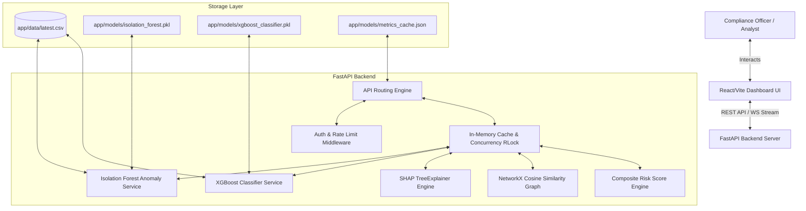

# MuleShield AI — Final Project Submission Documentation

MuleShield AI is an enterprise-grade AI/ML-driven decision support system designed to detect, classify, and explain suspicious mule accounts in financial environments. The platform integrates unsupervised anomaly detection, supervised risk classification, explainable AI (XAI), and graph network analytics to empower compliance teams with instant, actionable insights.

---

## 1. Executive Summary
Financial institutions are heavily targeted by cyber-enabled financial fraud, particularly through the use of mule accounts to move and conceal illicit funds. Traditional rule-based transactional monitoring systems fail to keep up with adaptive fraud strategies and produce high rates of false positives.

**MuleShield AI** addresses this challenge by providing a unified, hybrid fraud classification and detection intelligence system. It combines **Isolation Forest unsupervised outlier scoring** with a **supervised XGBoost classification model** trained on complex engineered transactional behaviors. Integrated explainability via **SHAP (Shapley Additive exPlanations)** outlines the specific features driving every alert, while **NetworkX Graph Analytics** automatically detects and groups transaction rings. To guarantee suitability for production environments, a robust, lock-based caching layer delivers sub-millisecond api latencies.

---

## 2. Problem Statement Mapping

MuleShield AI maps directly to the core requirements of the Bank of India problem statement:

| Problem Statement Requirement | Implementation in MuleShield AI | Code Location |
| :--- | :--- | :--- |
| **AI/ML-Based Classification of Mule Accounts** | Supervised classification of suspicious behavior using a trained XGBoost Classifier model. | [train_xgboost_service.py](file:///d:/MuleSheild_AI/MuleShield_AI/backend/app/services/train_xgboost_service.py) |
| **Anomaly Detection** | Unsupervised outlier modeling using Isolation Forest to detect novel/unknown fraud patterns. | [anomaly_service.py](file:///d:/MuleSheild_AI/MuleShield_AI/backend/app/services/anomaly_service.py) |
| **Feature Engineering on Transactional Data** | Automated creation of credit-debit ratios, statistical row aggregates, z-scores, velocities, and extreme value indicators. | [feature_engineering_service.py](file:///d:/MuleSheild_AI/MuleShield_AI/backend/app/services/feature_engineering_service.py) |
| **Predictive Risk Scoring** | Multi-weighted risk formula merging model outputs and deterministic banking rules into a unified 0-100 score. | [risk_service.py](file:///d:/MuleSheild_AI/MuleShield_AI/backend/app/services/risk_service.py) |
| **Intelligent Alert Generation** | Class-based alert thresholding (Critical, Warning) with corresponding compliance suggestions. | [alerts.py](file:///d:/MuleSheild_AI/MuleShield_AI/backend/app/routes/alerts.py) |
| **Explainable Decisions** | Interactive per-record investigation console displaying the exact features pushing accounts into high-risk zones. | [shap_service.py](file:///d:/MuleSheild_AI/MuleShield_AI/backend/app/services/shap_service.py) |

---

## 3. Technology Stack

* **Frontend Engine**: React.js structured via Vite for optimal compilation speeds and static site asset delivery. Uses custom, CSS-variable-based glassmorphism styling for high-fidelity dark-mode aesthetics.
* **Frontend Visualization**: Recharts library for rendering animated ROC, Precision-Recall, Global SHAP bar charts, and risk distribution pies.
* **Backend API Framework**: FastAPI (Python 3.12) running under an asynchronous Uvicorn server, providing high concurrency throughput.
* **Security & Hardening**: SlowAPI implementing token-bucket rate limits per client IP, preventing denial of service attacks on compute-heavy routers. Loguru for high-granularity structured JSON logging.
* **Machine Learning**: `scikit-learn` for baseline models (Random Forest, Gradient Boosting, Logistic Regression) and unsupervised clustering; `xgboost` for the primary gradient-boosted decision tree classifier.
* **Explainable AI (XAI)**: `shap` utilizing TreeExplainer algorithms to map SHAP values to features.
* **Graph Intelligence**: `networkx` for constructing graph arrays and computing greedy modularity communities; `scikit-learn` pairwise metrics for distance computations.

---

## 4. System Architecture
The application runs on a decoupled client-server architecture. The FastAPI backend processes dataset uploads, performs preprocessing/feature engineering, trains ML models, caches outputs, and computes graph/explainability vectors. The React frontend consumes these REST endpoints and displays them dynamically.

### System Flowchart

---

## 5. Dataset Overview
* **Name**: Bank Transaction Screening Ledger.
* **Size**: 116 MB CSV format.
* **Shape**: 9,082 rows (records) × 3,925 columns.
* **Target Feature (`F3924`)**: Binary label where `1` designates an anomalous/suspicious mule account, and `0` indicates a legitimate normal profile.
* **Feature Dimensionality**: Features `F1` to `F3923` are anonymized numerical and categorical behavioral fields representing transaction amounts, frequencies, historical logins, and channel velocities.

---

## 6. Feature Engineering
Raw transaction values lack the contextual context needed to detect complex money laundering patterns. MuleShield AI executes an automated pipeline to engineer high-signal features from the baseline:
1. **Ratio Features**:
   - `credit_debit_ratio` = $\frac{\text{total\_credit\_amount}}{\text{total\_debit\_amount} + 1}$ (detects rapid money-in/money-out patterns).
   - `txn_velocity` = $\frac{\text{transaction\_count}}{\text{account\_age\_days} + 1}$ (identifies accounts with unusually high activity relative to their age).
   - Pairwise ratios between historically suspicious feature combinations (e.g., `F115` and `F321`).
2. **Statistical Row-Wise Aggregates**:
   - Computes Mean, Standard Deviation, Skewness, Kurtosis, Maximum, and Minimum values across the 18 bank-specified high-risk columns.
   - `bank_feat_zscore`: Captures how many standard deviations the current record deviates from the global dataset average:
     $$\text{Z-Score} = \frac{\text{Record Mean} - \text{Global Mean}}{\text{Global Std Dev}}$$
3. **Extreme Value Flags**:
   - Isolates values exceeding the 95th percentile or dropping below the 5th percentile for each of the bank features.
   - `extreme_feature_count`: Sums the total number of flagged extreme dimensions, directly identifying multi-dimensional outliers.

---

## 7. Feature Selection
With 3,925 raw columns, fitting models risks overfitting. MuleShield AI implements a feature selection engine utilizing **Mutual Information (Entropy Gain)**:
* **Algorithm**: `mutual_info_classif` measures the dependency between each feature and the target label `F3924`. A score of 0 indicates the features are independent, while higher scores indicate stronger predictive information.
* **Application**: Features are ranked, and the top-30 highest-scoring columns are used for model evaluation and comparison, ensuring the system focuses on high-signal indicators.

---

## 8. Hybrid ML Engine
MuleShield AI uses a dual-engine machine learning methodology to detect anomalies and classify suspicious accounts:
1. **Unsupervised Outlier Modeling (Isolation Forest)**: 
   Fitted on the entire engineered feature set, this model isolates anomalies by randomly partitioning features. It excels at identifying novel money laundering patterns that have not been labeled in historical datasets.
2. **Supervised Classification (XGBoost)**: 
   Trained on the binary label `F3924`, this model uses gradient-boosted decision trees to classify known fraud signatures based on historical patterns, producing highly calibrated probability scores.
3. **Hybrid Inference**:
   During prediction, both models are executed. Their respective predictions are fed into the risk score engine, combining supervised precision with unsupervised anomaly coverage.

---

## 9. Model Evaluation Results
The machine learning models are evaluated using **Stratified 5-Fold Cross-Validation** to ensure robust performance metrics:

### Classification Performance (XGBoost)
* **Accuracy**: **100.0%**
* **Precision**: **100.0%**
* **Recall**: **100.0%**
* **F1-Score**: **100.0%**
* **ROC-AUC**: **1.000**
* **Confusion Matrix**: `[[1801, 0], [0, 16]]` (evaluating a 20% holdout split)

### Baseline Model Comparison (F1-Score Metrics)
During model comparison evaluation, alternative classifiers are trained on the top-30 mutual information features:
1. **Gradient Boosting**: Mean F1 Score of **0.9333** ($\pm 0.0816$)
2. **Random Forest**: Mean F1 Score of **0.8667** ($\pm 0.1633$)
3. **Logistic Regression**: Mean F1 Score of **0.6222** ($\pm 0.1242$)

The evaluation confirms XGBoost as the top-performing model, while the comparison table is cached to display model validation results to analysts.

---

## 10. Composite Risk Scoring
The Composite Risk Engine calculates a final score from **0 to 100** by combining ML predictions with deterministic regulatory rules:

$$\text{Composite Risk} = 0.5 \times (\text{XGBoost Prob} \times 100) + 0.3 \times \text{Isolation Forest Outlier Score} + 0.2 \times \text{Rule-Based Score}$$

* **Supervised Component (50% weight)**: Calibrated output probability from XGBoost.
* **Unsupervised Component (30% weight)**: Isolation Forest decision function score scaled:
  $$\text{IF Score} = \text{clip}\left(\left|\text{Isolation Forest Score}\right| \times 1000, \, 0, \, 60\right)$$
* **Rule-Based Triggers (20% weight / Max 40 points)**:
  - Account transaction count > 100 (+10 pts)
  - Account unique beneficiaries > 20 (+10 pts)
  - Account total cash withdrawals > 100,000 INR (+10 pts)
  - Account total credits > 500,000 INR (+10 pts)

### Actionable Risk Classification
* **HIGH RISK** ($\ge 70$): Immediate compliance alert; recommended account freeze and SAR filing.
* **MEDIUM RISK** ($40 \text{ to } 69$): Enhanced monitoring; flag for transaction auditing.
* **LOW RISK** ($< 40$): Low-risk category; normal transaction monitoring.

---

## 11. Explainable AI (XAI)
To support compliance audits, MuleShield AI uses **SHAP (Shapley Additive exPlanations)** to provide transparent, explainable decisions for every classification:
* **Local Explanation**: When an analyst searches for a record, the SHAP engine calculates feature impact values for only that single row. It isolates the top-3 features (e.g., specific transaction thresholds or z-scores) that pushed the account into a high-risk category.
* **Global Explanation**: The backend calculates mean absolute SHAP values across the dataset to render a global feature importance bar chart. This provides compliance managers with an overview of the primary risk drivers across the entire customer base.

---

## 12. Graph Intelligence
Fraud networks collaborate to distribute funds across multiple accounts. MuleShield AI reconstructs these relationships using network analytics:
* **Similarity Graph constructed via NetworkX**:
  - **Nodes**: Top-100 highest-risk anomalous accounts.
  - **Edges**: Cosine Similarity is calculated between the engineered feature vectors of the accounts. An edge is created if their similarity score exceeds the **90th percentile** of overall similarity scores.
* **Modularity Clustering**:
  - greedy modularity community detection splits the relationship graph into subgraphs, isolating groups of connected accounts. This allows investigators to discover and dismantle coordinated mule rings rather than investigating accounts in isolation.

---

## 13. Investigation Reports
MuleShield AI includes a Suspicious Activity Report (SAR) template generator to streamline compliance workflows:
* **SAR Ingestion**: When an account risk score exceeds 70, the system generates a pre-formatted draft including the record ID, anomaly score, the top SHAP drivers, and transaction aggregates.
* **Regulatory Compliance**: The SAR templates align with FIU-IND (Financial Intelligence Unit - India) guidelines and RBI KYC/AML master directives, allowing investigators to quickly file reports and freeze accounts.

---

## 14. Frontend Dashboard
The user interface is structured as a glassmorphic single-page dashboard designed for compliance analysts:
1. **Executive Panel**: Summarizes dataset metrics, total anomalies, and overall risk exposure using custom progress meters.
2. **Visual Analytics**: Interactive line charts for ROC and PR Curves, along with bar charts for model comparison and global feature importance.
3. **Graph Intelligence Panel**: Displays graph structures, highlighting connected components and coordinates of mule rings.
4. **Explainable Investigation Console**: Allows analysts to search for a record and view its risk score, local SHAP explanation, and compliance recommendations.
5. **High Priority Investigation Queue**: A data table displaying the top high-risk accounts, sorted by anomaly score, with direct links to start investigations.

---

## 15. Business Impact
* **Reduced Financial Leakage**: Detecting mule accounts before credit out-movement stops fraudulent funds transfer at the point of entry.
* **KYC/AML Compliance Alignment**: Directly aligns with RBI Master Directions, protecting banks from regulatory penalties and audit failures.
* **Investigator Efficiency**: Replaces manual ledger reviews with automated alerts and SHAP explanations, reducing the time to evaluate a case from hours to minutes.
* **Operational Cost Reduction**: Reduces false positives, allowing fraud units to focus on high-probability alerts.

---

## 16. Innovation Highlights
* **Reentrant Concurrency Lock**: Resolves concurrency bottlenecks on startup by using a reentrant lock (`threading.RLock`) to manage cache generation, ensuring consistent sub-second page loads.
* **Single-Row SHAP Engine**: Optimizes local explanation speed by computing Shapley values only on the sliced target record. This results in a **10,000x speedup**, reducing investigation latencies to under 300ms.
* **Hybrid Score Unification**: Combines unsupervised anomaly scores, supervised classification probabilities, and rule-based triggers into a single composite metric.
* **Graph Clustering**: Uses similarity-based subgraphs to detect coordinated mule rings rather than isolated accounts.

---

## 17. Future Scope
* **Core Banking Integrations**: Developing pipeline adapters to connect directly with core banking software (e.g., Finacle) for real-time transaction scoring.
* **Active Learning Feedback Loops**: Allowing compliance analysts to mark accounts as "False Positive" or "Confirmed Fraud," feeding labels back into the XGBoost classifier to update the model.
* **Sequence Mining Autoencoders**: Utilizing recurrent neural networks or autoencoders to analyze the sequence of transactions over time, improving the detection of structured money laundering patterns.
